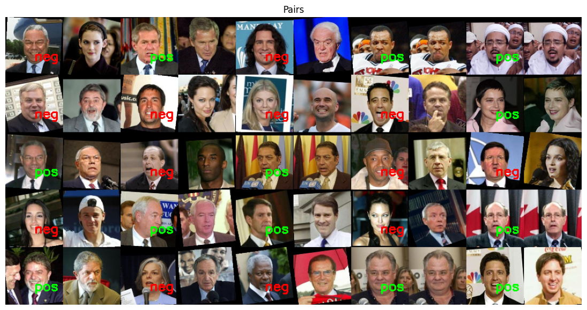
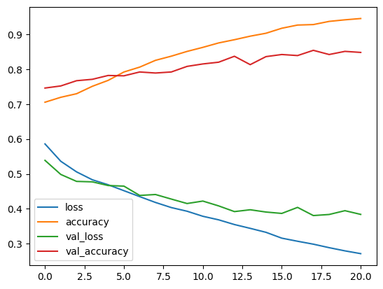
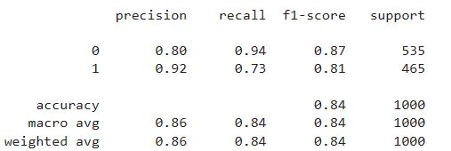
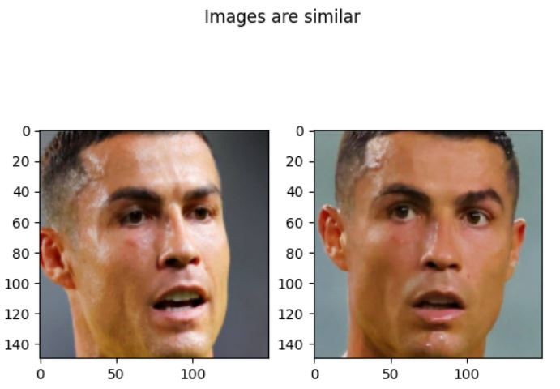

# Faces Similarity 👨‍🦱 ↔ 👳‍♀️ ≈ 0.0

Finding similarity between two images is a complex task that requires a deep understanding of their underlying structures, rather than merely comparing their color distributions. This repository aims to address this challenge by employing a deep learning model capable of detecting subtle changes and differences in images, enabling accurate similarity analysis.

# The Siamese Nural Network:

  The Siamese Neural Network, utilized in this project, operates by learning the intricate patterns present in images and subsequently computing the distance between them. By establishing a threshold, the network determines whether the images are similar or dissimilar based on their learned features.

## 🛠 This repo contain set of python folder sperated in this way:

  --`About data` notbook: contain description about data used in this project.

  --`load data` notbook: contain the processes followed to prepare faces.

   --`Model Training` notbook: Build Models and Train it on faces.

  --`Face_sim` notbook: contain models load and how to use.

  -- `data` folder: contain data used in project.

  -- `modeling` folder: contain model folder and files.

 -----
 ### Note:  The steps for finding simailarity are that a given image gets passed for MTCNN to detect a face in the image first, then images comes throw Siamese Neural Network

## Data

## Plot one class images

## Data as paires 

## Evaluation of machine learning model

## Validation result (classification report)

## Predict result

#### For more information,Feel Free To Reach me out [(\^_^)](https://www.linkedin.com/in/mahmoud-abu-zubaidah-bab3981a3/)

# End